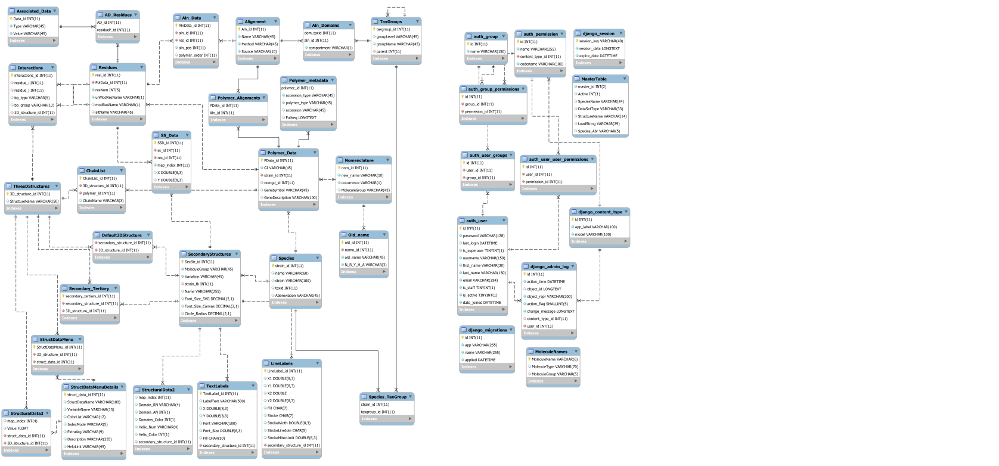

# Populating DESIRE

## Introduction

DESIRE is a MySQL database that provides a relational abstraction for species taxonomy, polymers, domains, residues, annotation data, alignments, and secondary structures.

The schema for DESIRE is quite complex and includes many tables:

The table can be generated with [create_tables.sql](./create_tables.sql), which is autogenerated from MySQL workbench. If the file is too old it should be generated anew by logging in MySQL Workbench and using the reverse engineer MySQL syntax menu.

Every month a backup of the MySQL database is created at /home/Desire-Server/SEREB_latest.sql This file can restore the entire DESIRE database by recreating the SEREB schema.

To correctly update each of these tables and their relationships there are python scripts which establish a connection to the server and take different data as inputs. The scripts are organized in folders that indicate what type of data will be handled.

When adding new data to the database you are changing the data served to users online, therefore it is imperative to have multiple checks on the accuracy of the data. This is also the reason many of hte upload steps are broken down in smaller steps and involve intermediary files. My reccomendation is to use the test schema SEREB_test on Apollo2 to ensure you are adding things correctly and without errors, before amending the SEREB schema which is being shown to users online.

This guide will go over the steps for uploading new species, their taxonomy, and updating the existing alignments with sequences for these species. Additionally, the guide has a section on uploading a new alignment to the server.

The file [launch.json](../.vscode/launch.json) has debugging configurations for several upload scripts, which show the necessary command line arguments.

## Taxonomy

The first step in adding new species involves updating the taxonomy. DESIRE treats taxonomy as a recursive relationship between the following taxonomic levels:

superkingdom, phylum, class, order, family, genus, species, strain

each taxonomic level has a parent, except the superkingdoms, which have a parent set to 0.

New species can uploaded by providing a list of taxonomic identifiers to the [upload_taxonomy2.py](./Phylogeny/upload_taxonomy2.py) script:

> upload_taxonomy2.py PATH_TO_NEW_TAXIDS NEW_TAXONOMY_JSON DB_USERNAME -dl -commit

The first argument of the script (PATH_TO_NEW_TAXIDS) is a text file that has the taxids for new species separated with newlines.

The second argument of the script (NEW_TAXONOMY_JSON) is a path to the location where the taxonomy recursive datastructure should be located. If you do not have that json file the script can automatically download and generate this file with the -dl flag.

The flag -commit commits the upload statements to the database. You might want to do a dry run test without this flag before pushing changes to the database.

## Polymers

Uploading new polymer entries to the database comes next. This involves generating a csv file that contains the species taxids, polymer accessions, accession source, polymer names, and polymer sequences from a fasta sequence file. This csv is then used to upload the data to the DESIRE database.

1. Parsing accessions - to generate the csv from a fasta file there are 2 files that can be used: [parse_accession.py](./Polymers/parse_accession.py) and [parse_accession2.py](./Polymers/parse_accession2.py). Both of them try to do some cleanup of the fasta and generate as clean of a csv as possible. The difference is [parse_accession.py](./Polymers/parse_accession.py) was written to facilitate the initial upload of DESIRE data and uses %%% as identifier for lines that should contain the taxids.

	Therefore for new data with properly formatted fasta you should be using [parse_accession2.py](./Polymers/parse_accession2.py). The format of the identifier line in the fasta should look like this:

	> eL06_13706_SYNRA|ORZ00342.1

	The identifier is spearated in two by the pipe symbol (\|). The first element defines the polymer name, species taxid, and up to 5 letter species abbreviation, separated by underscore (\_). The 5 letter species abbreviation is optional, but the separator isn't (eL06_13706\_\|ORZ00342.1). The second element is the accession ID. The script tries to guess whether the accession comes from UNIPROT or NCBI but can make mistakes with pdb ids, so any csv output should be **manually checked**. To parse many fasta files in a directory you can execute script like so:

	> for f in PATH_TO_FASTAS/*.fas; do ./parse_accession2.py -a $f -o ./CSV/OUTPUT_CSV.csv ;done

	The output CSV file is opened in append mode so new polymer entries will be added to the bottom.

2. Uploading accessions - with the generated and checked CSV file you can upload new polymer entries to DESIRE with the [upload_accession.py](./Polymers/upload_accession.py) script:

	>./upload_accession.py -c ./CSV/OUTPUT_CSV.csv

	The script skips lines starting with #.
	This script is a little old so the argument parameters do not allow for flexible adjustment of schema, host, and commit. If you want to use the SEREB_test schema you will have to directly edit the script and change the database= parameter on line 29.

## Alignments

